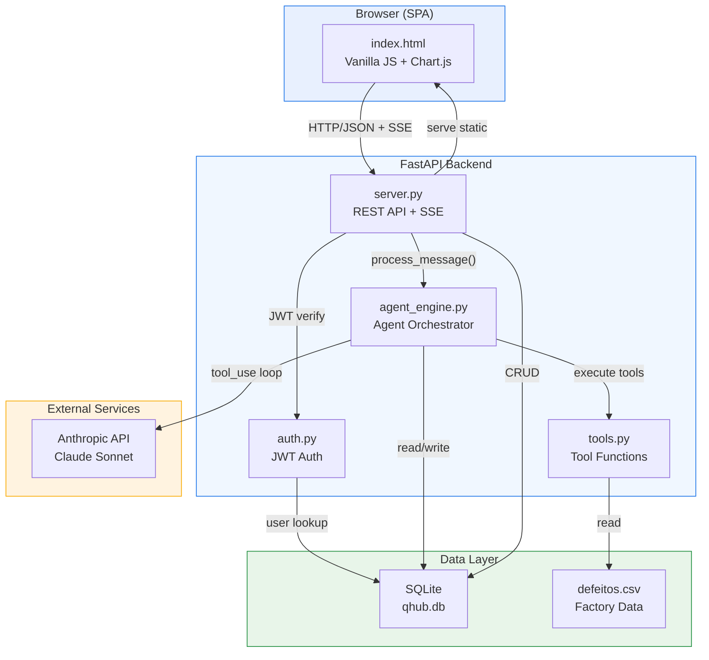
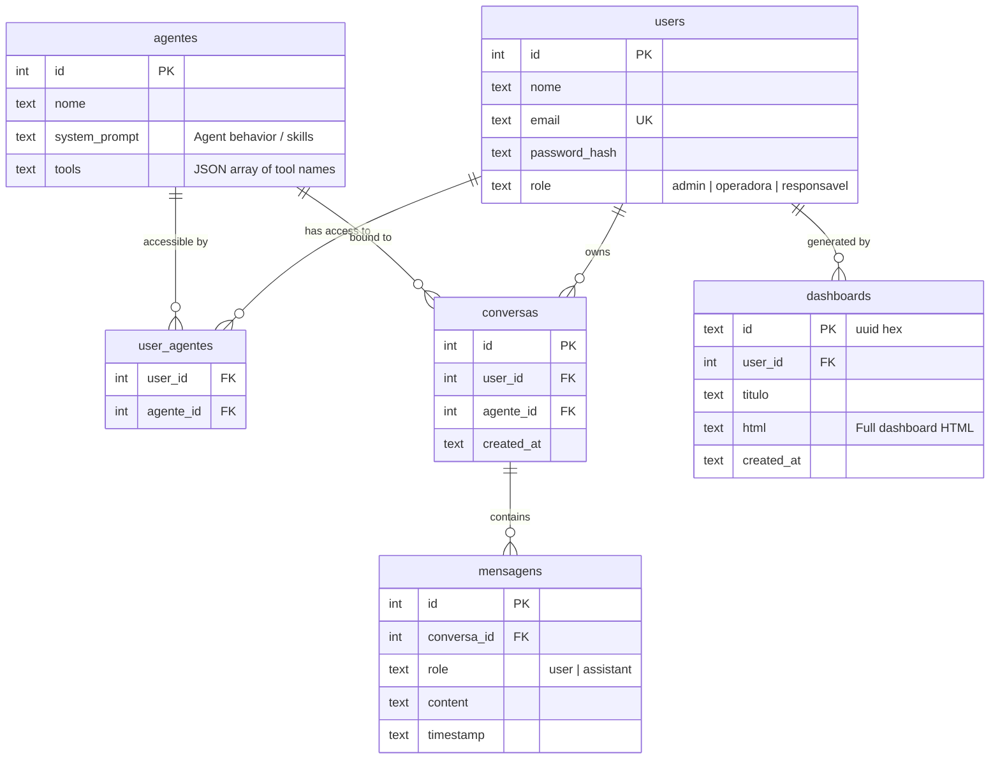
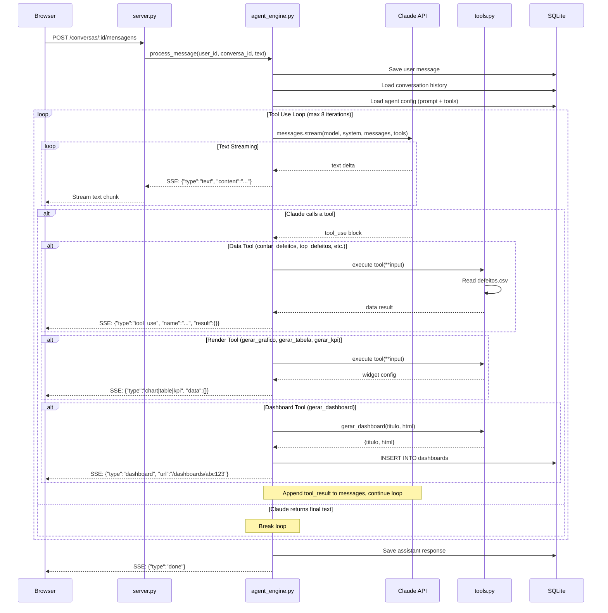
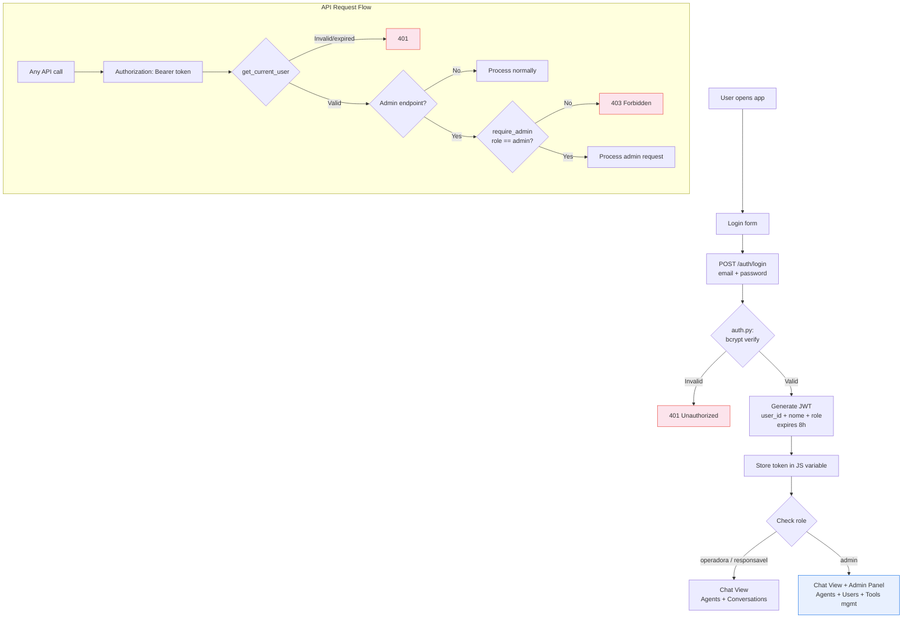
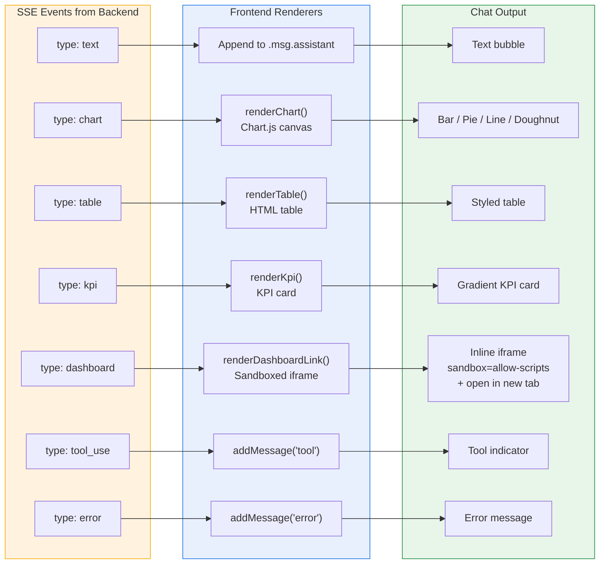
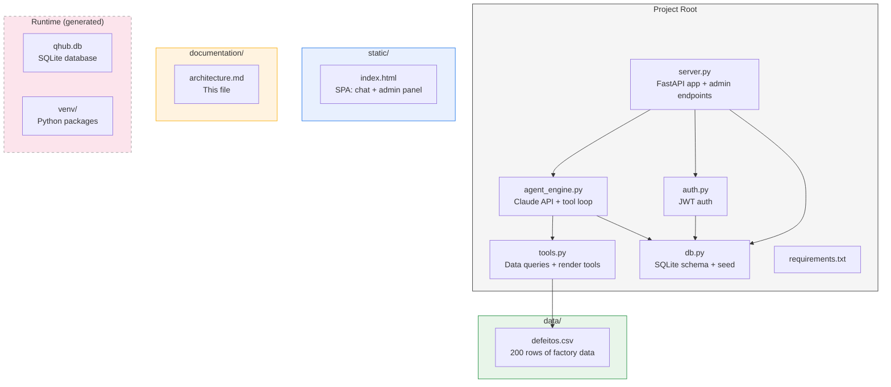
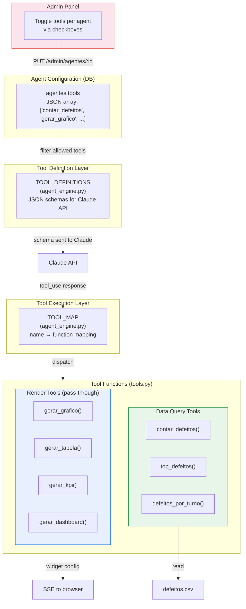

# QHub PoC — System Architecture

## 1. High-Level Architecture

## 2. Entity Relationship Diagram

## 3. API Endpoints Map

```mermaid
graph LR
    subgraph Public
        LOGIN["POST /auth/login"]
        DASH_VIEW["GET /dashboards/:id"]
    end

    subgraph Authenticated["Authenticated (JWT)"]
        AG_LIST["GET /agentes"]
        CONV_CREATE["POST /conversas"]
        CONV_LIST["GET /conversas"]
        MSG_LIST["GET /conversas/:id/mensagens"]
        MSG_SEND["POST /conversas/:id/mensagens<br/>(SSE stream)"]
    end

    subgraph Admin["Admin Only (role=admin)"]
        ADM_AG["GET/POST /admin/agentes<br/>PUT/DELETE /admin/agentes/:id"]
        ADM_TOOLS["GET /admin/tools"]
        ADM_USERS["GET/POST /admin/users<br/>PUT/DELETE /admin/users/:id"]
        ADM_UA["GET/PUT /admin/users/:id/agentes"]
    end

    LOGIN --> |"returns JWT"| Authenticated
    Authenticated --> |"role check"| Admin

    style Public fill:#e8f5e9,stroke:#1e8e3e
    style Authenticated fill:#e8f0fe,stroke:#1a73e8
    style Admin fill:#fce4ec,stroke:#e8453c
```

## 4. Chat Message Flow (SSE Streaming + Tool Use Loop)

## 5. Authentication & Authorization Flow

## 6. Frontend Rendering Pipeline

## 7. File Structure

## 8. Tool System Architecture

